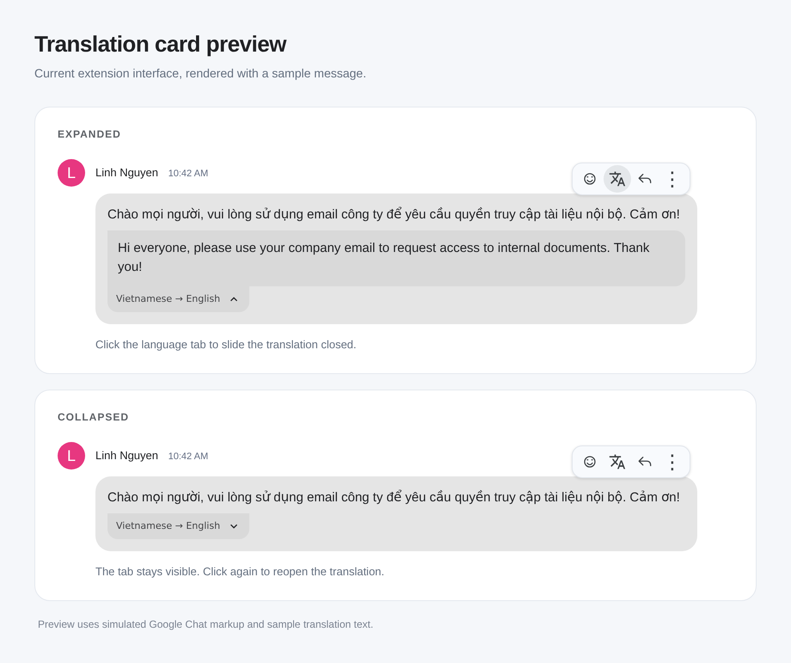

# Local Chat Translator

A Manifest V3 extension that adds a translation icon to the hover toolbar of individual Google Chat messages. Chrome translates on your device. The original message stays readable, and you can hide or show each result.

Supports `https://chat.google.com/*` and Gmail's `https://mail.google.com/mail/u/<account>/#chat/` view, including embedded Chat frames. There is no server, API key, cloud translation fallback, or telemetry.



## Install from source

Requires Node.js 22 or newer, npm, and desktop Google Chrome with the built-in Translator API. Chrome introduced the Translator and Language Detector APIs in version 138. Availability also depends on your device, browser configuration, language pair, and administrator policies.

```sh
npm ci
npm run build
```

1. Open `chrome://extensions` in Chrome and enable **Developer mode**.
2. Click **Load unpacked** and select this repository's `dist/extension` directory.
3. Reload your Google Chat or Gmail tab.
4. Open the extension's toolbar popup, choose a target language, and save.
5. Hover over a message and click the translation icon next to **Add reaction**. Use the tab beneath the translation to slide the card closed or open again without translating again. The tab stays visible when the card is hidden.

The first request may download Chrome's language models. An animated skeleton and model progress appear below the message. The skeleton and sliding card respect reduced-motion settings. If a download outlasts Chrome's user-activation window, click **Retry translation** to continue. Once the models are ready, each message translates with one click. Click the toolbar icon again to cancel a pending request. Hiding the card with its tab lets the translation finish in the background.

The popup can turn all translation controls off. It also offers a source-language override for short or mixed-language messages that automatic detection cannot identify. Settings changes apply to open tabs and clear previous translations.

## Privacy and permissions

The extension only requests `storage`. Its content scripts match the two Google hosts above. Gmail's URL fragment cannot appear in a manifest match pattern, so the script checks the Chat route at runtime. It does not select email bodies or compose fields.

Message text is passed only to Chrome's local APIs. In Gmail, a small extension service worker relays requests from the Chat iframe to the same tab's top frame because cross-origin frames cannot normally call those APIs. Neither the relay nor settings store message text. Chrome itself may download models from Google.

Read the [privacy policy](extension/privacy.html). Google Chat still handles your conversations under Google's policies. Inline translations, like the original messages, are part of the page and are visible to scripts that can access it.

## Development and tests

```sh
npm ci
npm test
npx playwright install chromium
npm run build
npm run test:browser
npm run package
```

On Linux, `npx playwright install --with-deps chromium` can install missing browser dependencies. Browser tests install the actual built extension in a temporary Chromium profile. They use synthetic Chat markup and controlled local API doubles for deterministic translation results. A separate assertion checks that native APIs are exposed in the isolated content-script world. No Google account is needed for these tests.

See [the manual test checklist](docs/MANUAL_TESTING.md) and [validation results](docs/VALIDATION.md) for the scope of verification. Passing fixtures does not prove compatibility with every current Google Chat layout or real model download environment.

## Package

`npm run package` writes `artifacts/local-chat-translator-0.1.1.zip` and its SHA-256 checksum. The ZIP contains only runtime files and the license. File order, timestamps, permissions, and uncompressed ZIP entries are fixed, so the same locked dependencies and source produce the same bytes. Python 3 is required for packaging. Generated output is ignored by Git.

The archive can be extracted and loaded unpacked or submitted to the Chrome Web Store. This repository does not publish or sign releases automatically.

## How the code fits together

- `messages.js` owns Chat selectors and text extraction.
- `translator.js` owns native model availability, progress, translation, and cleanup.
- `chat.js` adds separate controls, tracks message edits and removals, and cancels obsolete work.
- `frame-translation.js` and `background.js` route embedded Chat requests within the same tab.
- `settings.js` stores only the enabled preference and language choices.

All source is in `extension/src`. Esbuild bundles it without runtime dependencies. A MutationObserver discovers new messages and invalidates changed ones. An existing unchanged message keeps its control; extension output is excluded from extraction. Model results are rendered as text, never as HTML.

## Limits and troubleshooting

Google Chat has no public DOM contract for extensions. Its selectors can change. If buttons disappear after a Chat update, report the browser version and affected view without private message text.

If Chrome reports an unavailable model, check browser updates, enterprise policies, disk space, and network access for model downloads. Choose another language pair if needed. There is no remote fallback. Incognito and browsers other than supported desktop Chrome may not provide these APIs.

Very short text, names, emoji, and messages containing several languages can be hard to detect. Set the source language manually. Machine translations can be inaccurate; the original is always retained.

After updating or reloading the extension, reload existing Chat pages. Translations are temporary and disappear on reload, navigation that removes the message, or settings changes.

[Contributing](CONTRIBUTING.md) · [Security](SECURITY.md) · [MIT license](LICENSE)

Independent project; not affiliated with Google.
